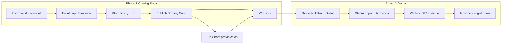

Your public brand is **Provinica**; the Godot repo (`my-colony-sim`, sibling of this site) still uses the internal name "My Colony Sim" in `project.godot`. On Steam, use **Provinica** everywhere. This site (`src/lib/game-content.ts`, `/game`, DevTalk) already contains most of the copy you need.

**Do not execute blindly** — work through phases when you are ready. Track high-level progress on `/admin/steam`.



---

## Phase 0 — Prerequisites (do before touching Steamworks)

| Item | Your status | Action |
| --- | --- | --- |
| Steamworks partner account | Unknown | Pay $100 USD fee at [partner.steamgames.com](https://partner.steamgames.com), complete tax/bank forms (allow 1–3 business days) |
| Legal entity / tax info | Required | Individual or company — needed before you can publish |
| Public game name | Ready | **Provinica** (subtitle optional: *Roman Colony Builder*) |
| Honest dev status | Ready | Pre-alpha, no release date — matches `developmentStatus` in `src/lib/game-content.ts` |
| Screenshots | Partial | 9 images on site; `colony_overview.png` missing in game repo — run capture script (see Phase 1 art) |
| Trailer | Not yet | Optional for Coming Soon; **required** for Next Fest demo |

**Timing note:** Reddit + DevTalk first, Steam Coming Soon when you have capsule art and 5+ polished screenshots. Demo + Next Fest only after a **20–40 minute** curated play session exists (`STEAM_NEXT_FEST_CHECKLIST` in `src/lib/marketing-hub.ts`).

---

## Phase 1 — Create the Coming Soon store page

### Step 1: Register the app in Steamworks

1. Log in to [Steamworks](https://partner.steamgames.com).
2. **Apps & Packages → All Applications → Add New App**.
3. Choose **Game** (not DLC/tool).
4. Set **App name:** `Provinica`.
5. Note your **App ID** — you will need it for depots, builds, and linking.

### Step 2: Configure basic app settings

In **Edit Steamworks Settings** for the app:

- **Supported systems:** Windows, Linux, macOS (export presets already exist in `my-colony-sim/export_presets.cfg`).
- **Release state:** set to **Coming Soon** (not full release).
- **Release date:** leave **To be announced** — no fake date; Steam allows TBA for Coming Soon.
- **Developer / Publisher:** your studio name (can match "Provinica Dev Team" from devtalks).
- **Franchise / series:** leave blank for now.
- **Website:** `https://provinica.ch`
- **Support URL:** `https://provinica.ch` or a mailto until you add a support page.

### Step 3: Store page — written content (copy-paste drafts)

Steam has several text fields. Below is ready-to-adapt copy sourced from this site.

**Short description** (appears in search/cards, ~300 chars max):

> Provinica is a Roman colony builder on a fixed terrace grid. Survey your grant, route real water through wells and aqueducts, zone housing on slopes, and keep colonists fed as families arrive from the road. Pre-alpha — follow the build on DevTalk.

**About This Game** (long description — use Steam BBCode `[h2]`, `[list]`, `[img]`):

```
[h2]Rome gave you the outline. The terraces don't care.[/h2]

You are the curator of a small colonia at the edge of the province — a strip of granted land with a curia, starter beds, ponds along low ground, and families waiting for orders. More people arrive from the road when word spreads. If you keep water, food, and roofs ready.

[h2]Plan on stepped ground[/h2]
[list]
[*] A 200×200 cell map with 1 m terrace steps
[*] Roads, housing districts, quarries, and aqueducts snap to the same grid the simulation reads
[*] Placement is planning, not painting
[/list]

[h2]Water is not decoration[/h2]
[list]
[*] Ponds, wells, and stone aqueducts use a cellular-automata flow model
[*] Cut a channel through a terrace and it drains somewhere
[*] Colonists path to wet ground when thirsty — not a magic radius
[/list]

[h2]Colonists carry the load[/h2]
[list]
[*] Timber, stone, and food move by haul jobs
[*] Workshops stall when stockpiles run empty
[*] Day/night cycles, happiness, and production chains you can read in the UI
[/list]

[h2]A charter, not an empire[/h2]
You start small. Rome gave you the outline. The rest is placement, water, and patience.

[h2]Development status[/h2]
Provinica is in active pre-alpha. Core placement, water, housing layout, and colonist logistics are playable in the Godot build. Follow honest dev progress at [url=https://provinica.ch/devtalk]provinica.ch/devtalk[/url].
```

**Core loop bullets** (optional extra paragraph or feature list):

1. Survey the grant — read terraces and ponds on your land
2. Place paths, housing districts, and work buildings
3. Route water with wells, channels, and aqueducts
4. Balance stone, timber, and food as families arrive
5. Expand from a charter village into something that feels like a province

**Tags** (pick 20 in Steamworks tag wizard — start with these):

- City Builder, Colony Sim, Simulation, Strategy, Sandbox
- Building, Resource Management, Economy, Management
- Historical, Rome, Singleplayer, 3D, Top-Down
- Realistic, Atmospheric, Indie, Early Access *(only if you plan EA at launch)*

**Genres:** Simulation + Strategy (primary), optionally Indie.

**Mature content survey:** Almost certainly none — violence is minimal in current build; re-check if combat ships publicly.

### Step 4: Store page — visual assets

Steam requires specific sizes. Map your existing assets:

| Asset | Steam size | Source |
| --- | --- | --- |
| **Header capsule** | 460×215 | **Create new** — crop `/game/colony-overview.png` with title "PROVINICA" |
| **Small capsule** | 231×87 | Same art, tighter crop |
| **Main capsule** | 616×353 | Hero: colony overview + tagline |
| **Vertical capsule** | 748×896 | Curator + colony or housing stage 4 |
| **Library hero** | 3840×1240 | Wide panorama from colony overview |
| **Library logo** | 1280×720 | Text logo on dark background |
| **Page background** | 1438×810 | Subtle terrace/aqueduct texture (optional) |
| **Screenshots** | 1920×1080 min | Capture at 1920×1080 from Godot |

**Screenshot shot list** (5–10 images, lead with strongest):

1. Colony overview — town hall, districts, terraces (`my-colony-sim/tools/capture_colony_overview.sh` at 1920×1080)
2. Aqueduct on terrace steps — `/game/aqueduct-corner.png`
3. Water channel / pond context — devtalk water assets
4. Housing stages 1→4 progression — `/game/housing-stage-01.png` through stage 04
5. Stone cutter / water-powered workshop — `/game/stone-cutter.png`
6. Material chain UI — `/game/material-chain.png`
7. Colonist working — `/game/colonist-working.png`
8. Stone house close-up — `/game/stonehouse.png`

Sync workflow:

```bash
# From provinica.ch — copies game assets + runs capture scripts
pnpm assets:sync
```

**Trailer (Coming Soon):** 30–60s is enough initially. Structure:

- 0–5s: Title + tagline ("Rome gave you the outline…")
- 5–25s: Terrace planning, water flowing, aqueduct placement
- 25–45s: Colonists hauling, housing upgrading, material chain UI
- 45–60s: "Wishlist on Steam" + provinica.ch/devtalk

Capture gameplay at 1080p from the Godot build; no release date card.

### Step 5: Pricing and packages

- Create a **store package** for the full game (even if unreleased).
- Set a **provisional price** (e.g. $15–25 for colony builders) — you can change before launch.
- **Coming Soon** pages can show price or hide it; showing a price early can anchor expectations.

### Step 6: Review and publish Coming Soon

1. **Store presence → Edit Store Page** — fill all required fields.
2. **Store presence → Review Changes** — fix any red errors (missing capsule, short description, etc.).
3. Click **Publish** (or schedule publish).
4. Steam review can take **3–7 days** for first-time partners.

### Step 7: Wire provinica.ch to Steam

After the page is live, update `storeLinks.steam` in `src/lib/game-content.ts` with the store URL and replace the disabled "Steam — soon" button on the homepage. Add the Steam widget or wishlist link to footer/nav.

---

## Phase 2 — Playable demo + Next Fest

The checklist on `/admin/steam` defines the bar.

### Step 8: Design the demo slice (in my-colony-sim)

Do **not** ship the raw tutorial sandbox as-is. Curate a **20–40 minute** experience:

- **Start:** Tutorial playthrough or a trimmed `sandbox_reset_baseline.save` with clear objectives
- **Showcase:** Terrace survey → path/housing district → well + channel → aqueduct span → stone chain → colonist growth
- **End:** Scripted "demo complete" screen with **Wishlist on Steam** button (opens Steam overlay URL)
- **Hide:** Dev hotkeys (P playthrough toggle), debug panels, unfinished buildings from `data/buildings.csv` that crash or look broken

Rename export product to **Provinica** in Godot project settings before shipping (currently "My Colony Sim").

**Build size warning:** Linux export was ~1.7 GB at time of writing — Steam allows it, but trim before demo:

- Exclude `tools/`, `imported_models/`, editor plugins (already in `export_presets.cfg` exclude_filter)
- Audit large textures/audio; consider a demo-specific export preset

### Step 9: Steam depots and upload

1. **Steamworks → Installation → General** — set launch executable:
   - Windows: `Provinica.exe`
   - Linux: `Provinica.x86_64`
   - macOS: `Provinica.app`
2. **Depots** — one depot per OS or a single multi-OS depot (simpler: 3 depots).
3. Install [Steamworks SDK](https://partner.steamgames.com/doc/sdk) and use **SteamPipe** (`steamcmd` + `app_build.vdf`).
4. Upload a **demo branch** or separate **Demo App** (Steam supports free demos linked to the main app — preferred for Next Fest).
5. Set **Launch options** / **Install folder** and test install on a clean machine.

Godot-specific: export **Release** builds, test without console wrapper for players.

### Step 10: Demo store configuration

- Add **Demo** button on main store page (Steam auto-links demo apps).
- Demo description: shorter than full game — "Try the charter: plan terraces, route water, and grow a Roman colonia. Save progress does not carry to the full game."
- Demo needs its own capsules (can reuse main art with "DEMO" badge).

### Step 11: Register for Steam Next Fest

1. Read [Next Fest docs](https://partner.steamgames.com/doc/marketing/upcoming_events/nextfest).
2. Register in Steamworks when the event opens (typical slots: Feb / Jun / Oct).
3. Submit demo build **2+ weeks before** fest start.
4. Requirements: playable demo, store page live, trailer recommended, community posts during fest.

**During fest:** Post dev updates using your Steam draft format from `pnpm devtalk:distribute` — title "Dev Update: …", link to devtalk, ask for wishlist.

### Step 12: Ongoing store maintenance

| Cadence | Action |
| --- | --- |
| After each devtalk | Run `pnpm devtalk:distribute` → post Steam community update |
| Monthly | Replace 1–2 screenshots if visuals improved |
| Before Next Fest | Fresh trailer, verify demo length, wishlist CTA in-game |
| Never | Fake release date, "launching soon" without evidence |

---

## What NOT to show on Steam yet

- Combat systems (CSV exists but not marketed — don't lead with it)
- Buildings that are internal/placeholder rows in `buildings.csv`
- Debug captures (`aqueduct_uv_preview`, material compare shots)
- Concept art (`roman-peasant-concept`, `map-concept`) as primary screenshots — fine in a "concept" carousel later, not as first impression
- Multiplayer, campaign, or empire-scale map — not in current pitch

---

## Suggested order of work (practical checklist)

1. Finish Steamworks account + tax
2. Create Provinica app
3. Run `pnpm assets:sync` and capture fresh 1920×1080 screenshots
4. Commission or DIY capsule art (header + main + vertical)
5. Paste store copy from Phase 1
6. Publish Coming Soon → update provinica.ch Steam link
7. Curate demo slice in Godot + wishlist end screen
8. Export trim + SteamPipe upload
9. Register Next Fest when demo is solid
10. Use `/admin/steam` checklist to track completion

---

## Key files to touch later (when you execute)

- `src/lib/game-content.ts` — `storeLinks.steam`
- `src/app/page.tsx` — enable Steam wishlist button
- `src/lib/marketing-hub.ts` — mark checklist items done
- `my-colony-sim/project.godot` — `config/name`, bundle ID
- `my-colony-sim/export_presets.cfg` — demo export path/name
